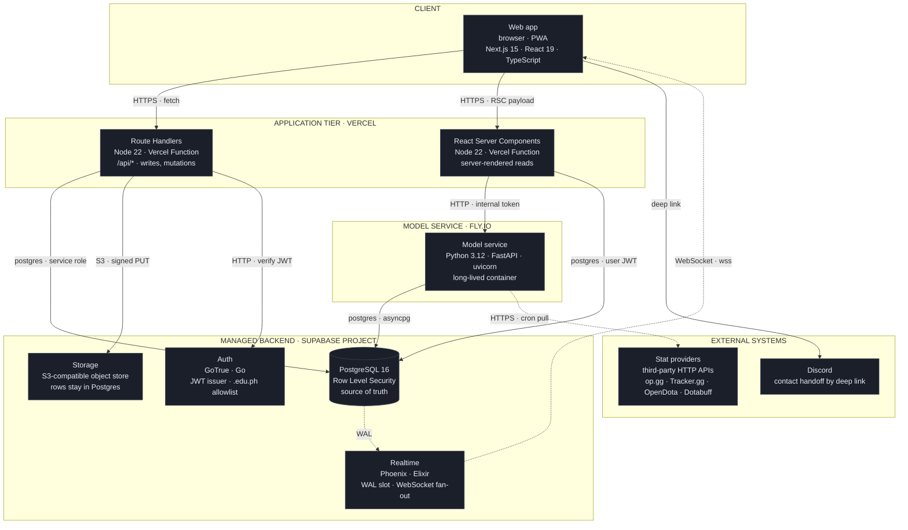
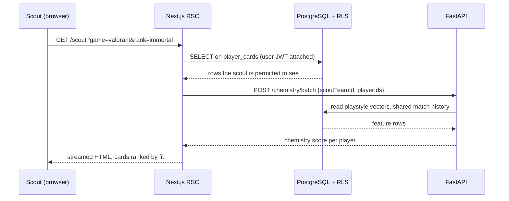
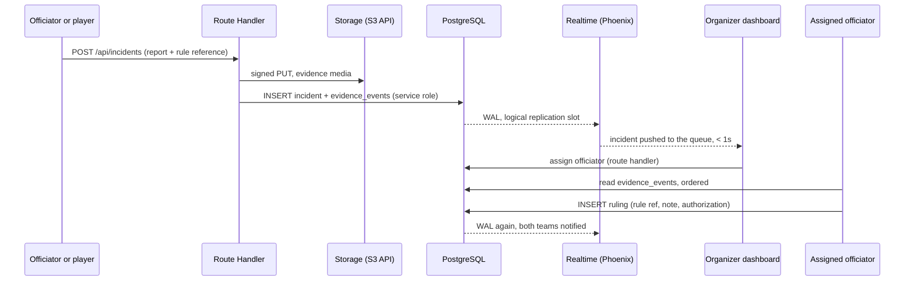
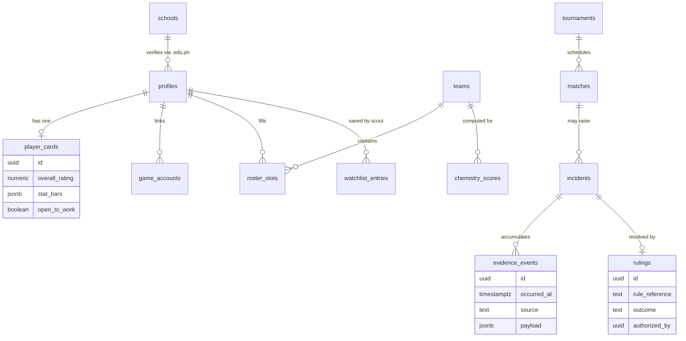
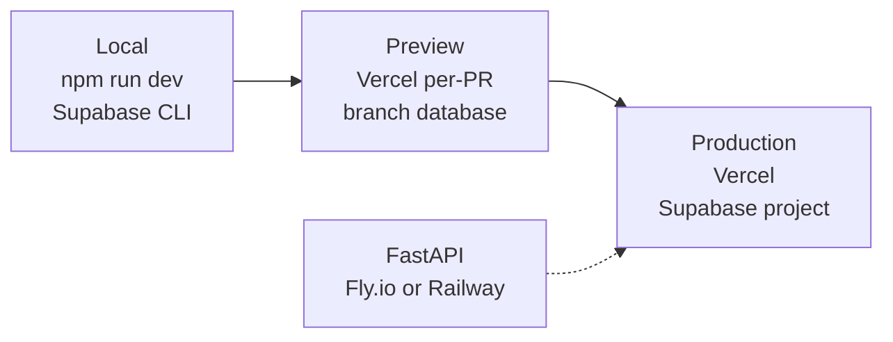

# SEAL Solution Architecture

**Team Hackatots** · The Next Gen 2026 · Owners: Dawn, Andrew

This document is the answer to the submission's *Architecture, Useable Assets and Tech Stack* section: how the frontend, backend, and database communicate, and what runs where.

---

## 1. Architecture at a glance

SEAL is a **serverless-first web platform with one long-lived model service**. Almost all of the product is Next.js route handlers talking to Postgres. The one thing that genuinely does not fit that shape, the chemistry model, gets its own Python container.

Two rules govern this document, because a diagram that breaks them is a feature list wearing an architecture costume:

1. **Every box is a separately deployed process or managed service.** If it is not something you can point a network diagram at, it does not get a box.
2. **Every line is a real protocol.** Product features are described in the request flows, never in the boxes.

That is why a Supabase project appears here as **four** boxes rather than one. Postgres, GoTrue, the object store, and the Realtime server are four separate processes speaking four different protocols, and collapsing them into a single "Supabase" box would hide the two decisions that matter most: where authorization is enforced, and how a client learns that a row changed.

### Why this shape

| Decision | Reason |
|---|---|
| Serverless Next.js as the default backend | One language across the app tier, one deploy, zero idle cost. A student team can ship it in a weekend. |
| A separate Python container, not more route handlers | The chemistry model is numeric work with real libraries (numpy, pandas, scikit-learn). Serverless cold starts and short timeouts are wrong for a process that loads those on boot. |
| Row Level Security as the enforcement boundary | Authorization lives in the database, not in UI checks. A bug in a React component cannot leak another player's private data. |
| A separate object store, not a Postgres column | Evidence is screenshots and clips. Binaries in table rows bloat the database and break replication, so the object store holds the bytes and Postgres holds the row that points at them, under the same RLS policies. |
| WAL replication, not polling | The Realtime server holds a replication slot on the write-ahead log, so an officiator sees an incident because the database committed it, not because a 30 second timer fired. The incident queue is the one screen where seconds matter. |
| One client, not two | An in-match desktop companion is a product feature we want, not a tier of this architecture. It would be an additional client talking to the same route handlers, so it can be added later without moving a box. |

---

## 2. How a request actually flows

### 2a. Read path, Scout Dashboard search

The key point for the judges: **the scout's JWT is what the database sees**. RLS decides visibility, so a player who has not toggled "Open to Work" never appears in the result set, no matter what the query asks for.

### 2b. Write path, an incident is filed and ruled

Note what is **not** here: nothing polls, and no client writes to Postgres directly. The route handler is the only thing holding the service role, and the only thing that can insert an evidence row.

Every row in `evidence_events` is append-only and timestamped. That is what makes the audit trail defensible when a team disputes a ruling, which is the exact failure that cost Andre his credibility in the problem statement.

---

## 3. Data model, the parts that matter

### Privacy classes

| Class | Contents | Who can read |
|---|---|---|
| Private | Email, phone, school ID image, unpublished draft cards | Owner only |
| Public profile | Player Card, stat bars, tournament history, school | Anyone, only when `open_to_work` or the card is published |
| Scout-visible | Contact handoff, watchlist notes | Verified scouts of a registered team |
| Officiating | Evidence timeline, rulings | Assigned officials of that tournament |
| Aggregated | Leaderboards, post-event incident reports | Public, anonymized |

Evidence media is uploaded **only by a signed URL scoped to one object**, is readable only by the assigned officials of that tournament, and drops on a fixed retention clock once the ruling is final. Organizers see the evidence attached to an incident, never a player's device or account. This is a deliberate design constraint, not a feature we can trade away for convenience.

---

## 4. The chemistry engine

The weighted model from the specification, implemented as a scored function rather than a black box, so a scout can see why a pairing scores what it scores.

| Signal | Weight | Source |
|---|---|---|
| Playstyle compatibility | 30% | Derived vectors from match stats |
| Historical win rate together | 25% | Shared match history |
| Role complementarity | 20% | Declared and inferred roles |
| Communication style | 15% | Self-reported profile fields |
| Agent or hero pool overlap | 10% | Linked game accounts |

Roster simulation reuses the same function: swap one `roster_slot`, recompute, and return the delta in chemistry, projected win rate, and overall rating. No separate model, no drift between what the dashboard shows and what the simulation predicts.

---

## 5. Environments and deployment

Database schema is versioned as SQL migrations in `supabase/migrations`, applied by CI. There is no manual schema editing in the dashboard, which is what keeps three developers from diverging during a 24 hour build.

---

## 6. Build phase scope

If Hackatots makes the top five on September 18, this is what gets built live, in order:

1. Auth plus `.edu.ph` verification, profiles, Player Card read path
2. Scout Dashboard search and filters against real rows
3. Chemistry service with the real weighted function
4. Incident ingest, Evidence Timeline, Ruling Workspace
5. Leaderboards and the post-event report

Items 1 through 3 give a complete recruitment demo. Item 4 completes the Maria and Andre story. Item 5 is the one that gets cut if time runs out.
