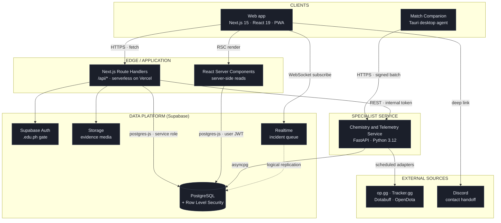
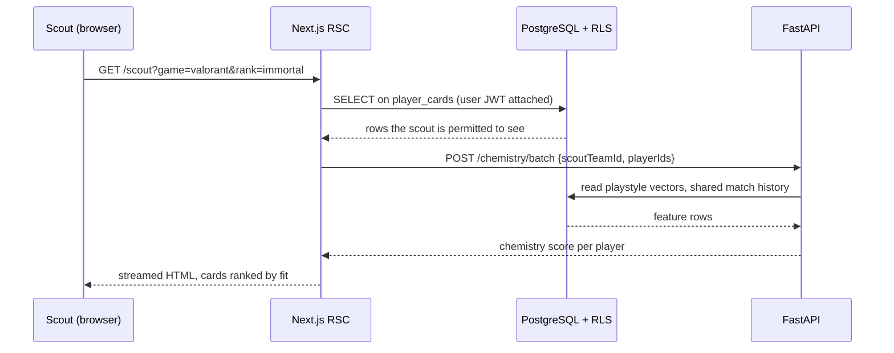
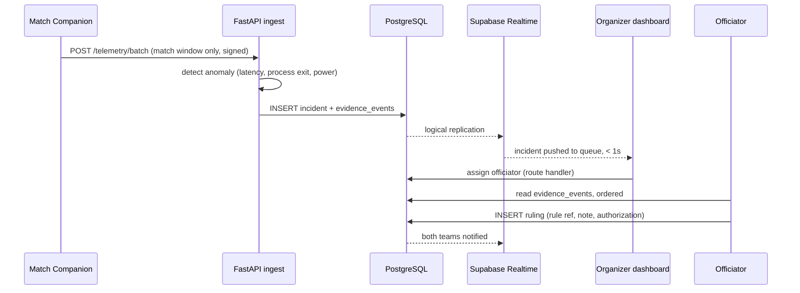
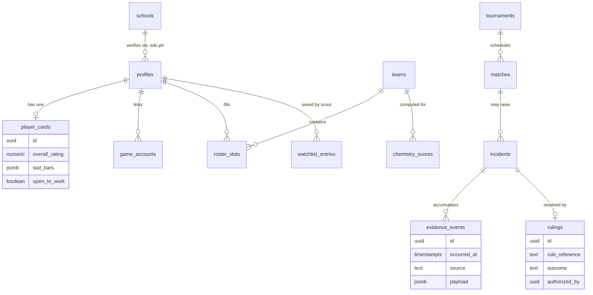
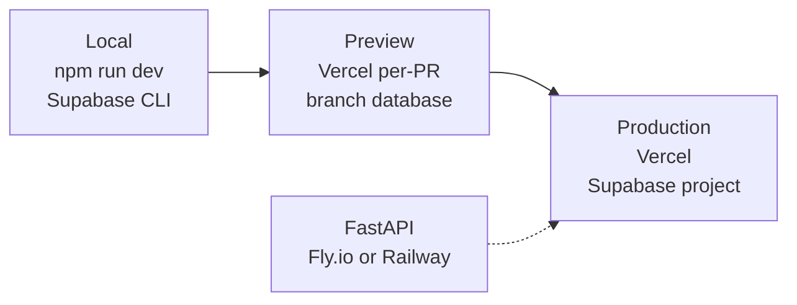

# DRAFT.PH Solution Architecture

**Team Hackatots** · The Next Gen 2026 · Owners: Dawn, Andrew

This document is the answer to the submission's *Architecture, Useable Assets and Tech Stack* section: how the frontend, backend, and database communicate, and what runs where.

---

## 1. Architecture at a glance

DRAFT.PH is a **serverless-first web platform with one specialist service**. Ninety percent of the product is Next.js route handlers talking to Postgres. The two things that genuinely do not fit that shape, the chemistry model and the telemetry ingest, get their own Python service.

### Why this shape

| Decision | Reason |
|---|---|
| Serverless Next.js as the default backend | One language across the app tier, one deploy, zero idle cost. A student team can ship it in a weekend. |
| A separate Python service, not more route handlers | The chemistry model is numeric work with real libraries (numpy, pandas, scikit-learn). Serverless cold starts and 10s timeouts are wrong for it, and telemetry ingest is a long-lived write path. |
| Row Level Security as the enforcement boundary | Authorization lives in the database, not in UI checks. A bug in a React component cannot leak another player's private data. |
| Supabase Realtime instead of polling | The incident queue is the one screen where seconds matter. Maria sees an incident when it happens, not on the next 30s poll. |
| Desktop agent, not a browser extension | Detecting an application crash or a power interruption requires process and network visibility the browser sandbox does not grant. |

---

## 2. How a request actually flows

### 2a. Read path, Scout Dashboard search

The key point for the judges: **the scout's JWT is what the database sees**. RLS decides visibility, so a player who has not toggled "Open to Work" never appears in the result set, no matter what the query asks for.

### 2b. Write path, live incident

Every row in `evidence_events` is append-only and timestamped. That is what makes the audit trail defensible when a team disputes a ruling, which is the exact failure that cost Andre his credibility in the problem statement.

---

## 3. Data model, the parts that matter

### Privacy classes

| Class | Contents | Who can read |
|---|---|---|
| Private | Email, phone, raw telemetry samples, school ID image | Owner only |
| Public profile | Player Card, stat bars, tournament history, school | Anyone, only when `open_to_work` or the card is published |
| Scout-visible | Contact handoff, watchlist notes | Verified scouts of a registered team |
| Officiating | Evidence timeline, rulings | Assigned officials of that tournament |
| Aggregated | Leaderboards, post-event incident reports | Public, anonymized |

Telemetry is collected **only inside a match window**, only with consent recorded per tournament, encrypted in transit, and dropped on a fixed retention clock. Organizers see derived indicators, never raw device access. This is a deliberate design constraint, not a feature we can trade away for convenience.

---

## 4. The chemistry engine

The weighted model from the specification, implemented as a scored function rather than a black box, so a scout can see why a pairing scores what it scores.

| Signal | Weight | Source |
|---|---|---|
| Playstyle compatibility | 30% | Derived vectors from match stats |
| Historical win rate together | 25% | Shared match history |
| Role complementarity | 20% | Declared and inferred roles |
| Communication style | 15% | Self-reported profile fields |
| Agent or hero pool overlap | 10% | Linked game accounts |

Roster simulation reuses the same function: swap one `roster_slot`, recompute, and return the delta in chemistry, projected win rate, and overall rating. No separate model, no drift between what the dashboard shows and what the simulation predicts.

---

## 5. Environments and deployment

Database schema is versioned as SQL migrations in `supabase/migrations`, applied by CI. There is no manual schema editing in the dashboard, which is what keeps three developers from diverging during a 24 hour build.

---

## 6. Build phase scope

If Hackatots makes the top five on September 18, this is what gets built live, in order:

1. Auth plus `.edu.ph` verification, profiles, Player Card read path
2. Scout Dashboard search and filters against real rows
3. Chemistry service with the real weighted function
4. Incident ingest, Evidence Timeline, Ruling Workspace
5. Leaderboards and the post-event report

Items 1 through 3 give a complete recruitment demo. Item 4 completes the Maria and Andre story. Item 5 is the one that gets cut if time runs out.
